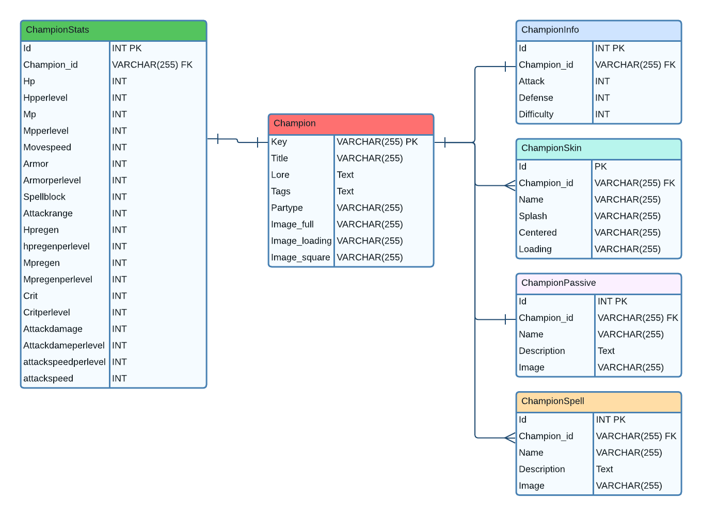

# League of Legends - Database
Este repositório contém um banco de dados voltado para fornecer recursos relacionados ao League of Legends para sites e aplicativos de base de fãs. É uma iniciativa pessoal para aprimorar habilidades em SQL e servir como um projeto de aprendizado.

A Riot Games disponibiliza todo o conteúdo atualizado relacionado ao jogo através do link [https://developer.riotgames.com/docs/lol](https://developer.riotgames.com/docs/lol), apenas baixei o patch atual.

##
### Direitos Autorais
League of Legends, personagens, imagens e todo o conteúdo protegido por direitos autorais relacionado ao League of Legends são propriedade da Riot Games, Inc.

##
### Aviso Legal sobre Uso de Imagens e Dados da Riot Games
A Riot Games permite explicitamente que sites de terceiros usem sua arte e skins de campeões.

##
### Diagrama Relacional

Atualmente, o banco de dados foi organizado principalmente para os "campeões" do jogo, contendo algumas informações relevantes sobre eles. Em breve, planejo adicionar mais entidades, como ícones, runas e talentos.

## Feedbacks
Feedbacks e sugestões são bem-vindos! Se você tiver ideias para melhorias ou encontrar problemas técnicos, por favor, compartilhe. Esses feedbacks serão importantes.
